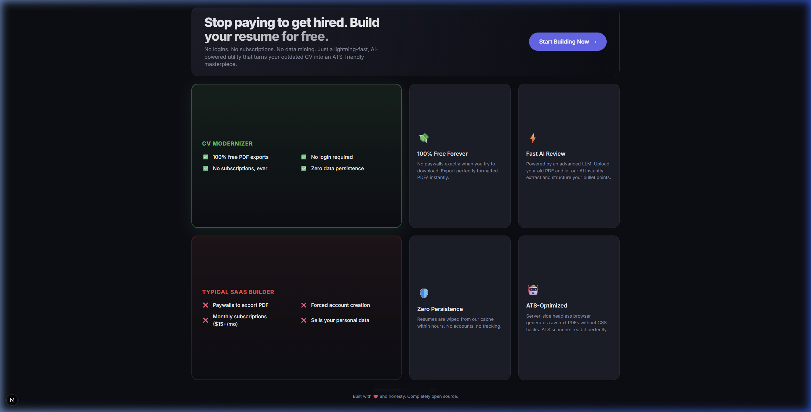
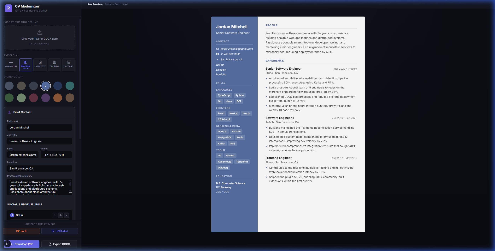
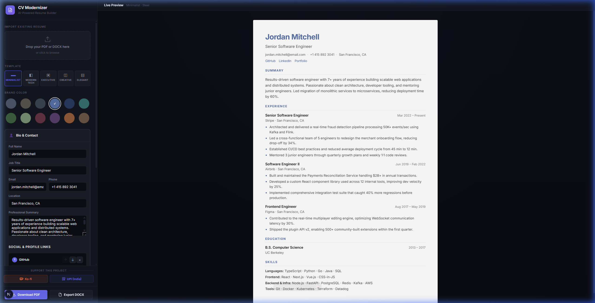

# CV Modernizer

> **A privacy-first, AI-powered resume modernization utility.**
> Upload an old PDF/DOCX, let Gemini parse it into a structured editor, pick a template, and download — all in one session. No account required. No files stored.

---

## Table of Contents

1. [Overview](#overview)
2. [Key Features](#key-features)
3. [Architecture](#architecture)
4. [Tech Stack](#tech-stack)
5. [Project Structure](#project-structure)
6. [Getting Started](#getting-started)
7. [Environment Variables](#environment-variables)
8. [API Reference](#api-reference)
9. [Privacy & Data Model](#privacy--data-model)
10. [Resume Templates](#resume-templates)
11. [Known Limitations](#known-limitations)
12. [Support the Project](#support-the-project)

---

## Overview

CV Modernizer is a stateless web utility that lets you:

- **Modernize** an outdated PDF or DOCX resume into a clean, editable structure
- **Edit** every section (bio, experience, education, skills, links) in a live side-by-side editor
- **Reorder** entries within sections using ↑/↓ controls
- **Preview** your resume rendered in multiple professional templates with theme colours
- **Download** the finished resume (PDF via Playwright / DOCX via python-docx)

No login. No cloud storage of your resume. No data sent anywhere beyond what is strictly needed.

---

## Screenshots

### 🏠 Landing Page


### ✏️ Live Side-by-Side Editor



---

## Key Features

| Feature | Details |
|---|---|
| 📄 **File Upload** | Accepts PDF and DOCX up to 5 MB |
| 🤖 **AI Extraction** | Gemini parses raw text → typed JSON (bio, experience, education, skills, links) |
| ✏️ **Live Editor** | Side-by-side accordion editor with instant preview |
| ↕️ **Reordering** | Move experience, education, and skill groups up/down |
| 🎨 **Templates** | 5 templates (Minimalist, Modern Tech, Executive, Creative, Elegant) |
| 🖌️ **Theme Colours** | 12 curated colour palettes |
| 🛡️ **Rate Limiting** | 3-hour cooldown per email via Supabase (prevents quota abuse) |
| 📱 **Mobile Ready** | Fully responsive with floating view-toggle and A4 scaling |
| 🔒 **Privacy-first** | Full resume content never persisted; only minimal metadata cached |
| ☕ **Donations** | UPI QR (India) and Ko-fi (international) |

---

## Architecture

```
┌─────────────────────────────────────────────────────┐
│                  Browser (Next.js)                  │
│  ┌──────────────┐        ┌───────────────────────┐  │
│  │   Editor.tsx │◄──────►│  ResumePreview.tsx    │  │
│  │  (sidebar)   │  state │  (live PDF-like view) │  │
│  └──────┬───────┘        └───────────────────────┘  │
│         │ POST /api/extract (FormData)               │
└─────────┼───────────────────────────────────────────┘
          │
          ▼
┌─────────────────────────────────────────────────────┐
│              FastAPI Backend (port 8000)             │
│                                                     │
│  1. Read file bytes (in-memory, never to disk)      │
│  2. Extract text  ← PyMuPDF (PDF) / python-docx     │
│  3. Regex guard   ← reject if no email or phone     │
│  4. Rate-limit    ← Supabase TTL check (3h window)  │
│  5. Gemini call   ← structured JSON extraction      │
│  6. Cache write   ← minimal record to Supabase      │
│  7. Return JSON   ─────────────────────────────►    │
└─────────────────────────────────────────────────────┘
          │                        │
          ▼                        ▼
   ┌────────────┐          ┌──────────────────┐
   │  Supabase  │          │  Gemini API      │
   │  cv_cache  │          │  (1.5 Flash / 8b)│
   └────────────┘          └──────────────────┘
```

---

## Tech Stack

### Frontend
| Package | Purpose |
|---|---|
| **Next.js 14** (App Router) | React framework, SSR |
| **TypeScript** | Type safety throughout |
| **Vanilla CSS** | Custom design system (no Tailwind) |
| **qrcode.react** | Live UPI QR code generation |

### Backend
| Package | Purpose |
|---|---|
| **FastAPI** | REST API framework |
| **Uvicorn** | ASGI server with hot-reload |
| **google-genai** | Google Gemini SDK (new v1.x) |
| **PyMuPDF (fitz)** | In-memory PDF text extraction |
| **python-docx** | In-memory DOCX text extraction |
| **playwright** | Server-side headless browser for pristine PDF rendering |
| **supabase-py** | Supabase client (rate-limit cache) |
| **python-dotenv** | `.env` loading |
| **python-multipart** | Multipart file upload parsing |

### Infrastructure
| Service | Purpose |
|---|---|
| **Supabase (Postgres)** | `cv_cache` table for rate-limiting |
| **Google AI Studio** | Gemini API key |

---

## Project Structure

```
CV Modernizer/
├── backend/
│   ├── main.py              # FastAPI app — full extraction pipeline
│   ├── requirements.txt     # Python dependencies
│   ├── schema.sql           # Supabase table + index definitions
│   └── .env                 # Secrets (not committed)
│
├── frontend/
│   ├── public/
│   │   └── upi-qr.png       # UPI QR fallback image (replaced by live QR)
│   └── src/
│       ├── app/
│       │   ├── page.tsx         # Root page (renders <Editor />)
│       │   ├── layout.tsx       # HTML shell, metadata
│       │   ├── globals.css      # Design system — tokens, layout, components
│       │   └── resume.css       # Resume template print styles
│       ├── components/
│       │   ├── Editor.tsx       # Main editor + upload flow + support section
│       │   └── ResumePreview.tsx# 5 resume templates rendered as styled HTML
│       └── types/
│           └── resume.ts        # Shared TypeScript types + defaultResumeData
│
└── README.md
```

---

## Getting Started

### Prerequisites
- **Node.js** ≥ 18
- **Python** ≥ 3.10
- A **Gemini API key** (free tier works) — [get one here](https://aistudio.google.com/app/apikey)
- A **Supabase project** (free tier) — [supabase.com](https://supabase.com)

### 1. One-Click VPS Deploy (Recommended)
The easiest way to deploy is using the automated script:
```bash
git clone <your-repo-url>
cd "CV Modernizer"
# For IP-based access:
bash deploy.sh
# For Domain-based access (Caddy/SSL):
bash deploy.sh yourdomain.com
```

### 2. Manual Setup (Local Development)

#### Prerequisites
- **Node.js** ≥ 20 (Required for Next.js 15+)
- **Python** ≥ 3.10
- A **Gemini API key** — [get one here](https://aistudio.google.com/app/apikey)
- A **Supabase project** — [supabase.com](https://supabase.com)

#### Backend Setup
```bash
python -m venv .venv
.venv\Scripts\activate          # Windows
# source .venv/bin/activate     # macOS/Linux

pip install -r backend/requirements.txt
playwright install chromium
cp backend/.env.example backend/.env
# Edit backend/.env with your keys
cd backend && uvicorn main:app --reload
```

#### Frontend Setup
```bash
cd frontend
npm install
npm run dev
```

Open **http://localhost:3000** in your browser.

---

## Environment Variables

All secrets live in `backend/.env`. **Never commit this file.**

```env
# ── Gemini AI ──────────────────────────────────────────────────────
GEMINI_API_KEY=AIza...

# Model to use for extraction (default: gemini-1.5-flash-8b)
# Options (pick one):
#   gemini-1.5-flash-8b   — lightweight, generous free-tier quota (default)
#   gemini-1.5-flash-002  — full Flash, better at complex CVs
#   gemini-2.0-flash-lite — latest, if your key has access
GEMINI_MODEL=gemini-1.5-flash-8b

# ── Supabase ────────────────────────────────────────────────────────
SUPABASE_URL=https://your-project-id.supabase.co
# IMPORTANT: Use the SERVICE ROLE key, NOT the anon key.
# The service role key bypasses Row Level Security — backend only, never expose to frontend.
SUPABASE_KEY=eyJ...
```

> [!WARNING]
> Always use the **service role** key in `SUPABASE_KEY`, not the anon key. The backend uses it server-side and it is never sent to the browser.

---

## API Reference

Base URL: `http://localhost:8000`

### `GET /api/health`

Liveness probe. Returns which env vars are configured.

```json
{
  "status": "ok",
  "gemini_key_set": true,
  "supabase_url_set": true,
  "supabase_key_set": true
}
```

---

### `POST /api/extract`

**Main extraction endpoint.** Accepts a PDF or DOCX file and returns a fully structured resume JSON.

**Request:** `multipart/form-data`

| Field | Type | Description |
|---|---|---|
| `file` | File | PDF or DOCX, max 5 MB |

**Success Response `200`:**
```json
{
  "resume_data": {
    "bio": { "name": "...", "title": "...", "email": "...", "phone": "...", "location": "...", "summary": "..." },
    "experience": [
      { "id": "exp1", "role": "...", "company": "...", "location": "...", "startDate": "...", "endDate": "...", "bullets": ["..."] }
    ],
    "education": [
      { "id": "edu1", "degree": "...", "institution": "...", "startDate": "...", "endDate": "..." }
    ],
    "skills": [
      { "category": "Languages", "items": ["Python", "TypeScript"] }
    ],
    "links": [
      { "label": "GitHub", "url": "https://github.com/..." }
    ]
  },
  "detected_email": "user@example.com",
  "detected_phone": "+91 9999999999",
  "raw_text_length": 3420
}
```

**Error Responses:**

| Status | Meaning |
|---|---|
| `400` | Invalid file type (not PDF/DOCX) |
| `413` | File exceeds 5 MB limit |
| `422` | No email or phone found in document |
| `429` | Same email processed within the last 3 hours |
| `503` | Gemini API key missing or quota exceeded |
| `500` | Unexpected server error |

> All error responses include a `detail` field with a human-readable message that is displayed directly in the upload zone UI.

---

### `POST /api/tailor`

*(Endpoint is live, UI wiring in progress)*

Performs gap analysis between a resume and a job description using Gemini.

**Request body:**
```json
{
  "resume_data": { ... },
  "job_description": "We are looking for..."
}
```

**Response:**
```json
{
  "analysis": {
    "missing_skills": ["Docker", "Kubernetes"],
    "suggestions": "...",
    "improved_summary": "...",
    "improved_bullets": [{ "exp_id": "exp1", "bullet_idx": 0, "new_text": "..." }]
  }
}
```

---

### `POST /api/export/pdf`

Generates a continuous, non-paginated PDF using a headless Chromium instance via Playwright.

**Request body:**
```json
{
  "html": "<!DOCTYPE html><html>...</html>"
}
```

**Response:** Binary PDF stream.

---

### `POST /api/export/docx`

Generates a perfectly styled Word Document via `python-docx`.

**Request body:**
```json
{
  "bio": { ... },
  "experience": [ ... ],
  "education": [ ... ],
  "skills": [ ... ]
}
```

**Response:** Binary DOCX stream.

---

## Privacy & Data Model

CV Modernizer is designed to minimise data retention.

### What is stored (Supabase `cv_cache`)

| Column | Example | Purpose |
|---|---|---|
| `email` | `user@example.com` | Deduplication key (UNIQUE) |
| `phone` | `+91 9999999999` | Secondary identity signal |
| `name` | `Jane Doe` | Display / debugging only |
| `experiences` | `[{company, role, startDate, endDate}]` | Metadata — **no bullet points** |
| `education` | `[{institution, degree, startDate, endDate}]` | Metadata only |
| `created_at` | `2026-04-19T05:00:00Z` | Immutable first-upload timestamp |
| `updated_at` | `2026-04-19T05:00:00Z` | TTL reference — updated on each re-upload |

### What is **never** stored

- The original PDF/DOCX file
- Resume bullet points / achievements
- Skills lists
- Links / URLs
- AI-generated output

### Rate limit logic

```
Upload request
  → extract email from raw text
  → query Supabase: SELECT updated_at WHERE email = ? AND updated_at >= NOW() - 3h
  → if row found: reject 429 with "try again in Xh Ym"
  → if not found: proceed → Gemini → INSERT/UPDATE cache
```

The TTL window is based on `updated_at` (not `created_at`), so re-uploading always resets the 3-hour clock.

### Upload Guards

The backend will reject an upload with `422` if:
- No valid email address is found in the extracted text
- No phone number is found in the extracted text

This prevents spam uploads and ensures the rate-limiting system has a reliable deduplication key.

---

## Resume Templates

Five templates are rendered purely in CSS/HTML — no image assets required.

| ID | Name | Style |
|---|---|---|
| `minimalist` | **Minimalist** | Clean single-column, generous whitespace |
| `modern-tech` | **Modern Tech** | Split layout — skills/contact sidebar + experience main |
| `executive` | **Executive** | Bold header bar, formal section dividers |
| `creative` | **Creative** | Accent left border, colourful section headers |
| `elegant` | **Elegant** | Serif-inspired, centred header, refined typography |

Each template respects the selected **primary colour** from 12 available palettes (Slate, Navy, Forest, Burgundy, Gold, Plum, Teal, Copper, Rose, Midnight, Sage, Steel).

---

## Known Limitations

| Area | Limitation |
|---|---|
| **Gemini quota** | Free-tier keys have request-per-minute limits. Heavy usage will hit `503`. Retry after ~60 seconds. |
| **Scanned PDFs** | Image-based PDFs (scans with no selectable text) will return no extracted text. Use a text-based PDF. |
| **Phone detection** | The regex targets common international formats. Unusual formatting (e.g. spaces instead of dashes) may not be detected. |
| **Export Height** | PDFs are generated as a single continuous sheet. If you want paginated A4 outputs, custom print margins need to be injected into the Playwright engine. |
| **Ko-fi payments** | Ko-fi's checkout (Stripe) cannot run inside an iframe or restricted popup. The Ko-fi button opens a standard browser popup. |
| **CORS** | Backend CORS allows `localhost:3000` and `localhost:3001` only. Update `allow_origins` in `main.py` before deploying. |

---

## Support the Project

If this tool saved you time, consider buying a coffee:

- ☕ **Ko-fi (international):** [ko-fi.com/yourhandle](https://ko-fi.com/yourhandle)
- 🇮🇳 **UPI (India):** `yourusername@upi`

Both options are available directly in the sidebar of the app.

---

## License

This project is licensed under the **MIT License**. See the [LICENSE](LICENSE) file for details.
